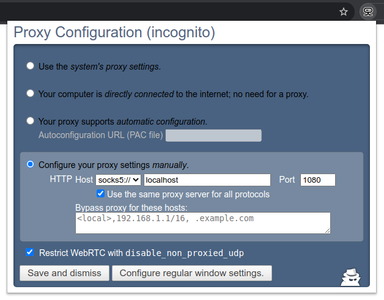

# Incognito Proxy 

This is a simple Chrome extension for configuring proxy settings. Its namesake feature is the ability to configure *different* settings for regular windows and incognito windows.

The code is based on `proxy_configuration` from [chrome-extensions-samples](https://github.com/GoogleChrome/chrome-extensions-samples/).

## WebRTC leak

When using a proxy, Chrome still leaks your IP address via WebRTC.
The official [WebRTC Network Limiter](https://chrome.google.com/webstore/detail/webrtc-network-limiter/npeicpdbkakmehahjeeohfdhnlpdklia) extension was abandoned in 2016, and doesn't work anymore, but [WebRTC Protect](https://chrome.google.com/webstore/detail/webrtc-protect-protect-ip/bkmmlbllpjdpgcgdohbaghfaecnddhni) seems to fix the problem.

TODO: Can I set `disable_non_proxied_udp` from this extension?

## Chrome Web Store link

https://chrome.google.com/webstore/detail/incognito-proxy/odkbcffeaickjalieahlneeehkgjpade

## Screenshot

## Why use this?

I wanted to make a Chromebook route incognito tabs through a VPN, without impeding regular tabs' network access.
This requires a VPN provider with WireGuard and a SOCKS5 proxy.
Configure WireGuard with **Allowed&nbsp;IPs:&nbsp;10.64.0.1/32** (or wherever your VPN provider's proxy is located),
and then use **Incognito&nbsp;Proxy** to make incognito tabs connect through that proxy.

Bonus: Chrome OS supports IPv6-over-SOCKS5 (but not IPv6-over-WireGuard, sigh), so you could also use this to reach
IPv6-only servers from anywhere.
